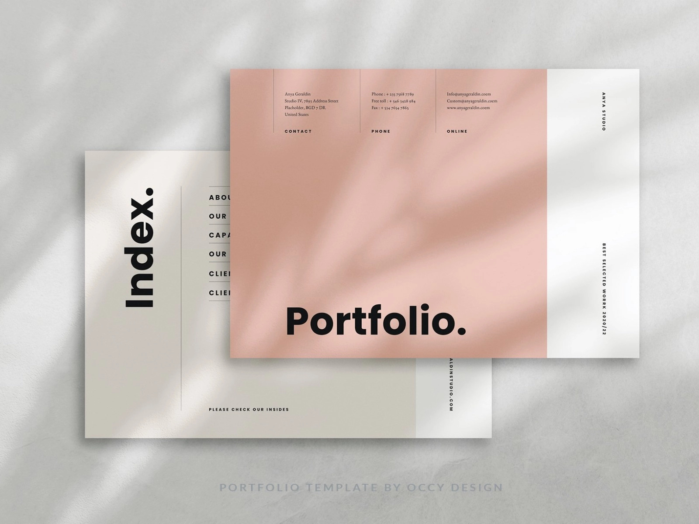

  

<h3 align="center">Basic Portfolio Design</h3>

---

 Portfolio Template, be tuned up for updated one !!!
      

## 📝 Table of Contents

- [About](#about)
- [Getting Started](#getting_started)
- [Authors](#authors)
- [Acknowledgments](#acknowledgement)

## 🧐 About 

A basic and simply curated portfolio design for digital resume, stay tuned for the more realistic and creative digital portfolio.

## 🏁 Getting Started 

This is a system plugin generated readme.md for portfolio designed website using ChatGPT feature.

## ⛏️ Built Using 

- [Express](https://expressjs.com/) - Server Framework
- [VueJs](https://vuejs.org/) - Web Framework
- [NodeJs](https://nodejs.org/en/) - Server Environment

## ✍️ Authors 

- [@elkryptic](https://github.com/elkryptic) - Idea & Initial work

## 🎉 Acknowledgements 

- Hat tip to anyone whose code was used
- Inspiration
- References
